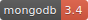
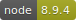

# ArkWars
   

Frontend and Backend for Arkwars (**working title!**) - a strategic turn-based game of galactic conquest.

Number of times `.env` file got submitted to github: **2** 

### Warning

This is a rough and early work in progress, it is far from ready to be used in any implementation whatsoever. 
There are lots of areas that don't work yet, lots of stuff will break again and again. 
Also, I am (ab-) using git as remote savefile, so there are lots of commits and no releases - yet.
 
Use at your own risk. 

## Requirements

* MongoDB 3.4 Database
* Redis database as session store
* NodeJS 8.9.4 LTS, npm 5.6.0

## Usage: npm Scripts

* `npm run server.start`: starts the backend server that serves rendered HTML pages, static assets and provides the REST API. 
* `npm run server.cron`: starts the cron server that checks each minute if there are turns to process, games to start etc. If this task does not run, no turns will be calculated.
* `npm run app.static.build`: cleanup, then generates static app assets - fonts, images, styles, icon spritesheet.
* `npm run app.static.watch`: watch static (gulp) assets and recompile / start tasks as needed.
* `npm run js.prod`: generate webpack bundles (including templates) for a **production** environment.
* `npm run js.dev`: generate webpack bundles (including templates) for a **development** environment and starts webpack-dev-server. webpack-dev-server will serve assets, only the pug template includes will be written to disk.
* `npm run files.cleanup`: empty directories with webpack-generated, git-ignored files.
* `npm run db.prune`: delete MongoDB collections.
* `npm run db.seed`: seed MongoDB with mock data.

## Documentation
(this needs work!)

* [Changelog](https://github.com/sscharfenberg/arkwars/blob/master/docs/CHANGELOG.md)
* [TODO](https://github.com/sscharfenberg/arkwars/blob/master/docs/TODO.md)
* [Installation](https://github.com/sscharfenberg/arkwars/blob/master/docs/INSTALLATION.md)

## Attribution

A list of used third party images can be found in the [Attribution](https://github.com/sscharfenberg/arkwars/blob/master/docs/ATTRIBUTION.md) page. All images used are in the public domain, have creative commons or other permissive licenses. 

This project uses a lot of open source software - without the efforts of all these maintainers/contributors, none of this project would be possible. For reference please check the dependencies.
